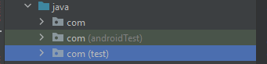

# SpigotCaseStudyApp

## Description

Simple native Android application written in Kotlin. 

The Application and includes:
1. MVVM Architecture - The architural pattern used to seperate the data presentation logic from the core business logic
2. Retrofit - To communicate between client and serve
3. Room Database - Handles the persistence of data received from API
4. ViewModel - To encapsulate the data for a UI allow data persistence regardless of configuration changes
5. Dagger-Hilt - To include dagger dependency injection in the application
6. ViewBinding - To replace findViewById and provide ease of coding views
7. RecyclerView - To display dataset and allow for sufficient scrolling
8. Coil - To load images into ImagView

## Unit Test

     
     

Webservice, ViewModel and Repository test would be done as JUnit4 test class.
